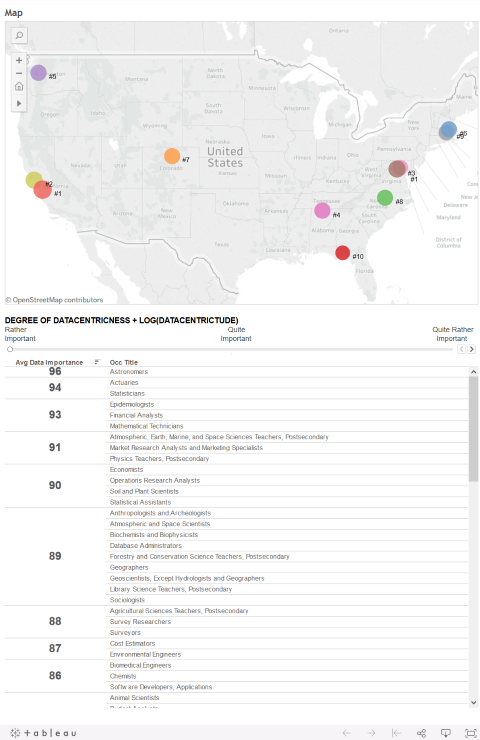
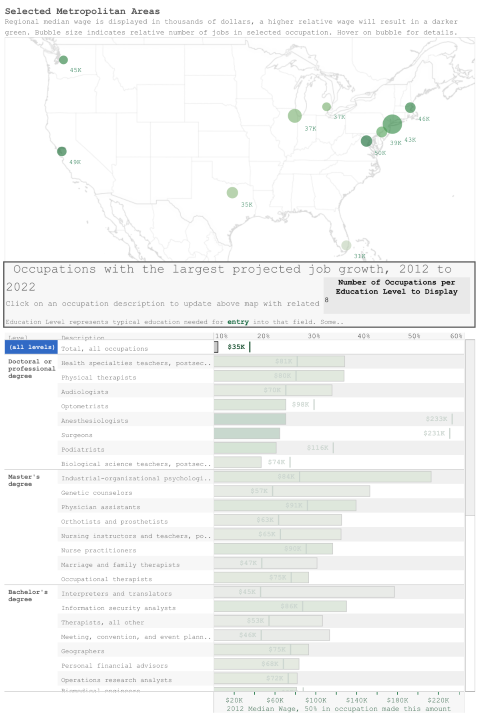

# Tableau Public

## Where are the Datacentric Jobs?

Visualization based on analysis performed in the "The Importance of Data Occupations in the U.S. Economy" report
created by the Economics & Statistics Administration agency but looking at metropolitan areas instead of states
and interactively allowing for a greater focus on the more datacentric occupations.

[html](http://htmlpreview.github.com/?https://github.com/owenGnet/viz/tableau/DatacentricJobs.html) | [oweng.net](http://oweng.net/data-visualization/tableau/tableau-datacentric-occupations-locations.aspx) | [Tableau Workbook](tableau/DatacentricJobs.twbx)

## Job Growth by MSA and Educational Attainment

NYU Data Visualization class, final project

A Tableau data visualization that summarizes expected employment growth by occupation
and metropolitan area, linked with various levels of educational attainment and median salary.

[html](http://htmlpreview.github.com/?https://github.com/owenGnet/viz/tableau/JobGrowthAndMSA.html) | [oweng.net](http://oweng.net/data-visualization/tableau/tableau-employment-growth.aspx) | [Tableau Workbook](tableau/EmploymentProjections.twbx)

